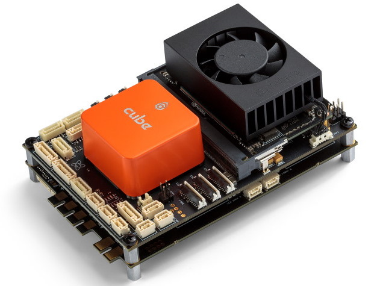
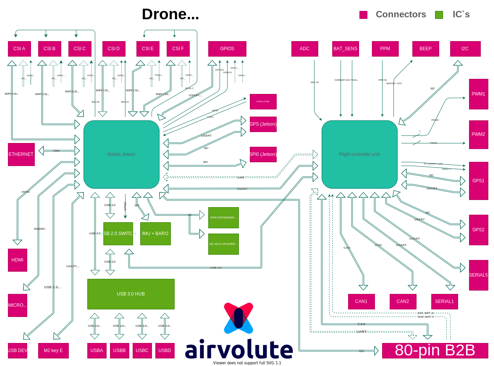
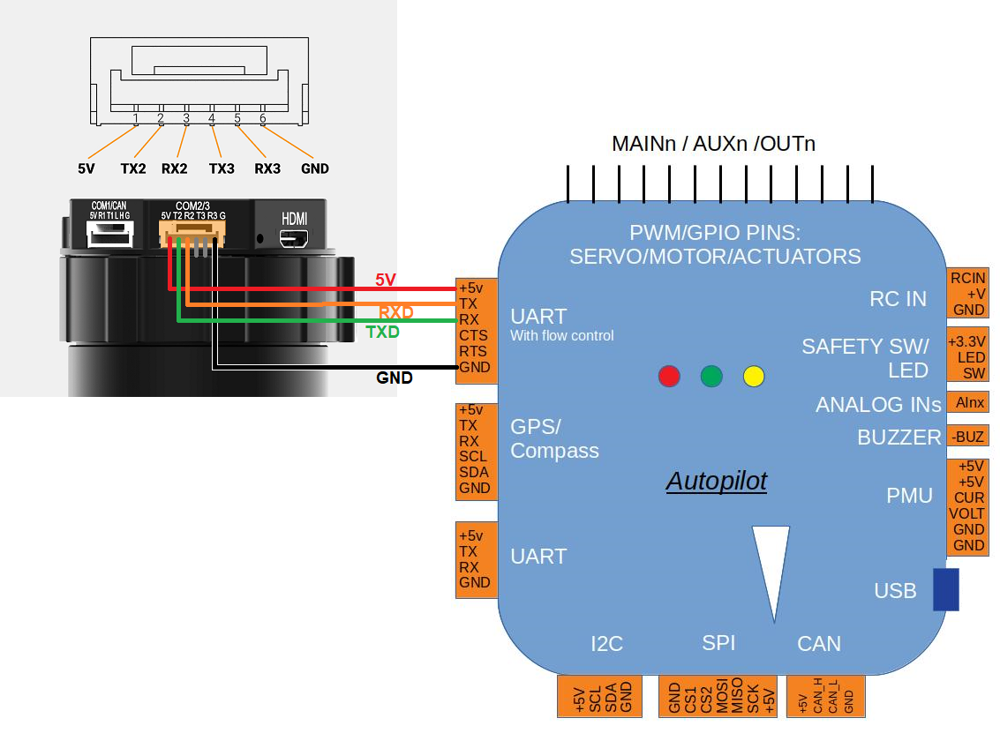

.. _common-airvolute-DroneCore-Suite:

===========================
Airvolute DroneCore.Suite
===========================

**DroneCore.Suite** is a one stop autopilot and flight computer solution for developers of advanced drone systems demanding high computing power and high level of modularity. It creates the "core" of the drone containing most of necessary electronics to fly a quadcopter.

It consists of a control part called **DroneCore.Pilot** and power part called **DroneCore.Power**.

-  **DroneCore.Pilot** - top board for control of the aircraft
   containing

   -  Jetson Xavier NX
   -  Cube flight controller
   -  Internal 5V power supply
   -  Power selector
   -  Peripheral connectors
   -  USB hub

-  **DroneCore.Power** - bottom board with power electronic containing

   -  4 FOC UAVCAN ESCs - 20A permanent / 40A peak current
   -  Power sensor (battery voltage and current measurement)
   -  Analog inputs for battery cell monitoring
   -  SMBUS
   -  LED Driver for 4 x WS2812B strips

DroneCore.Suite comes with both Cube and Xavier NX preconfigured and communicating together and able to control a quadcopter. Developers no longer need to solve basic communication and compatibility issues coming from connecting two different IT worlds. It They can start to concentrate on their application needs from the beginning.

Accompanying documentation provides a fast learning curve to start using various peripherals to control the drone and create the desired application.
Various software libraries (coming soon) further enrich the possibilities for the developer relieving him from complex configuration and programming tasks.

  DroneCore.Suite

DroneCore.Suite provides easy to use ROS based software stack supporting
development of autonomous applications.

Out of the box device is configured to fly a quadcopter (though flight
controller calibration is needed anyway).

Specifications:
^^^^^^^^^^^^^^^

**Mechanical parameters**

-  Weight 247g - including Cube orange, Xavier NX, Xavier heatsink with
   fan
-  Dimensions 115 x 80 x 45mm
-  Mount with 4 screws/spacers M3 109 x 74mm
-  WiFi module
-  WiFi antennas 2pcs

**Electrical parameters**

-  Power supply range: 12V – 35V (6S LiHV)
-  Integrated DC/DC converter for control circuits
-  Redundant power supply with power good monitoring for control unit
-  Current protected peripheral connectors
-  4 x FOC UAVCAN ESC 40A, featuring motor identification and motor
   diagnostics
-  Power sensor, SMBUS

**Ardupilot (Cube) Connections**

-  PPM input
-  PWM output (7 + 7 lines)
-  2x CAN
-  4x UART
-  2x I2C
-  Buzzer
-  Power sensor input
-  ADC input
-  Buzzer

**Jetson connections:**

-  PCI Express (M2, Key E connector)
-  4 USB 3.0 (ZIF connectors, reductions available)
-  Gigabit Ethernet (ZIF connector, reductions available)
-  6 CSI (22 pin)
-  4 GPIO
-  UAV CAN, UART, I2C, SPI
-  IMU BMI088 and barometer BMP388 on board
-  USB 2.0 for debugging
-  Micro SD card
-  Video output connector (micro HDMI)
-  Fan

**DroneCore.Power** (bottom power board)

-  4 x FOC UAVCAN ESCs – 40A peak / 20A permanent
-  power sensor, SMBUS,
-  LED Driver for 4x WS2812B strips

---------------------------
Block Schematic
---------------------------

   

**DroneCore.Pilot** is based on Cube Orange - widely used flight controller by Hex.aero running on Ardupilot (or optionally PX4 flight stack) and Nvidia Jetson Xavier NX. Their rich interfaces allow connecting of most of sensor and other peripherals for drones available on the market.

**DroneCore.Power** contains 4 FOC ESCs with motor identification feature able to be configured for all common BLDC/PMSM drone motors on the market and telemetry interface providing real time data from the flight to the flight controller. Furthermore it provides battery voltage and current measurements including separate cell voltages.

The Gremsy Pixy U is a 3-axis gimbal that can communicate with the flight controller using the MAVLink protocol, weighs 465g, and is compatible with a range of cameras for real-time video or mapping purposes.  More specifications can be found `here on the Gremsy website <https://gremsy.com/pixy-u-spec/>`__.  The user manual is `here <https://gremsy.com/pixy-u-manual/>`__.

Where to Buy
============

The Pixy U can be purchased from the `Gremsy store <https://store.gremsy.com/product/pixy-u/>`__

Connecting to the Autopilot
===========================

We recommend connecting the Gimbals's COM2 port to one of the autopilot's Serial/Telemetry ports like Telem2 as shown above.

Connect with a ground station and set the following parameters:

- :ref:`MNT_TYPE <MNT_TYPE>` to "4" for "SToRM32 MavLink"
- :ref:`SERIAL2_BAUD <SERIAL2_BAUD>` to "115" for 115200 bps.  "SERIAL2" can be replaced with another serial port (i.e. SERIAL1) depending upon the physical connection
- :ref:`SERIAL2_PROTOCOL <SERIAL2_PROTOCOL>` to 2 for "MAVLink2"
- :ref:`SR2_EXTRA1 <SR2_EXTRA1>` to 10
- :ref:`SR2_POSITION <SR2_POSITION>` to 10

The gimbal's maximum angles can be set using these parameters:

- :ref:`MNT_ANGMIN_ROL <MNT_ANGMIN_ROL>` to -3000 to allow leaning left up to 30deg
- :ref:`MNT_ANGMAX_ROL <MNT_ANGMAX_ROL>` to 3000 to allow leaning right up to 30deg
- :ref:`MNT_ANGMIN_TIL <MNT_ANGMIN_TIL>` to -9000 to allow pointing 90deg down
- :ref:`MNT_ANGMAX_TIL <MNT_ANGMAX_TIL>` to 3000 to allow pointing 30deg up
- :ref:`MNT_ANGMIN_PAN <MNT_ANGMIN_PAN>` to -18000 to allow turning around to the left
- :ref:`MNT_ANGMAX_PAN <MNT_ANGMAX_PAN>` to 18000 to allow turning around to the right

To control the gimbal's lean angles from a transmitter set:

- :ref:`MNT_RC_IN_TILT <MNT_RC_IN_TILT>` to 6 to control the gimbal's tilt (aka pitch angle) with the transmitter's Ch6 tuning knob
- :ref:`MNT_RC_IN_ROLL <MNT_RC_IN_ROLL>` to some input channel number to control the gimbal's roll angle
- :ref:`MNT_RC_IN_PAN <MNT_RC_IN_PAN>` to some input channel number to control the gimbals' heading

Gremsy's instructions can be found below:

- `How to setup Gremsy gimbal with Pixhawk Cube <https://support.gremsy.com/support/solutions/articles/36000189926-how-to-setup-gremsy-gimbal-with-pixhawk-cube>`__
- `Control Gremsy Gimbal with Herelink & Cube <https://support.gremsy.com/support/solutions/articles/36000222529-control-gremsy-gimbal-with-herelink-cube-pilot>`__

Configuring the Gimbal
----------------------

The gimbal should work without any additional configuration but to improve performance you may need to adjust the gimbal's gains to match the camera's weight

- Download, install and run the `gTune setup application <https://github.com/Gremsy/gTuneDesktop/releases>`__
- Connect the gimbal to your Desktop PC using a USB cable
- Push the "CONNECTION" button on the left side of the window, then select the COM port and press "Connect"
- Select the "CONTROLS" tab and ensure "SYNC" is selected so the gimbal communicates with the autopilot using MAVLink
- Select the "STIFFNESS" tab and adjust the Tilt, Roll and Pan gains so that the gimbal holds the camera in position without shaking

Testing Controlling the Gimbal from RC
--------------------------------------

- Disconnect the USB cable connecting your PC to the gimbal
- Powerup the vehicle and gimbal
- Move the transmitter's channel 6 tuning knob to its minimum position, the camera should point straight down
- Move the ch6 knob to maximum and the gimbal should point upwards

.. note::

   The RC's channel 6 input can be checked from Mission Planner's Radio calibration page

Testing ROI
-----------

The ROI feature points the vehicle and/or camera to point at a target.  This can be tested by doing the following:

- Ensure the vehicle has GPS lock
- If using the Mission Planner, go to the Flight Data screen and right-mouse-button-click on a point about 50m ahead of the vehicle (the orange and red lines show the vehicle's current heading), select **Point Camera Here** and input an altitude of -50 (meters).  The camera should point forward and then tilt down at about 45 degrees

.. image:: ../../../images/Tarot_BenchTestROI.jpg
    :target: ../_images/Tarot_BenchTestROI.jpg

Pilot control of the gimbal can be restored by setting up an :ref:`auxiliary function switch <common-auxiliary-functions>` to "Retract Mount" (i.e. RCx_OPTION = 27) and then move the switch to the lower position
